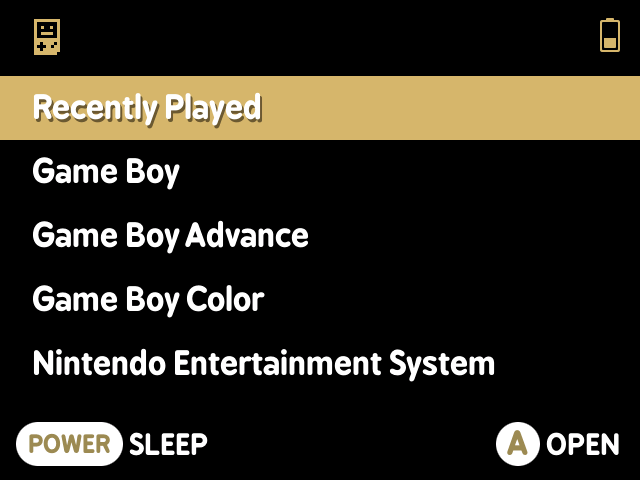
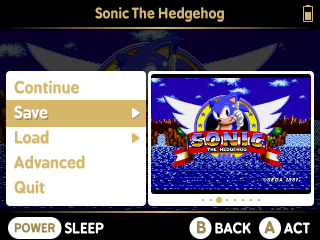

# MiniUI

_MiniUI is a custom launcher and integrated in-game menu for the Miyoo Mini_

 

MiniUI is simple, some might say to fault. That's okay. I think it's one of those things where, if you like it, even just a little bit, you'll love it.

MiniUI is defined by no. No boxart thumbnails. No video previews. No background menu music. No custom themes. No also rans. MiniUI is too full of self-loathing. It doesn't like launchers. It doesn't like being one. It wants to disappear and speed you on your way. MiniUI is unapologetically opinionated software. Sorry/not sorry. 

Check the [Releases](https://github.com/shauninman/MiniUI/releases) for the latest and if you want more info before downloading, the readme included in every release is also available [here](https://github.com/shauninman/MiniUI/tree/main/skeleton).

## What happened to Union?

The Miyoo Mini happened. The idea behind Union was the result of having a few of these handhelds but never being fully happy with any one of them in all contexts. One had a beautiful screen but was too heavy to carry around. One was perfectly pocketable and had amazingly clicky buttons but the tiny screen wasn't great for long play sessions. So Union allowed easily moving games and save data between devices depending on context. Literally just swapping the SD card from one device to the other. But the Miyoo Mini is pocketable enough, its screen gloriously 640 by 480 enough, that I stopped using the other devices supported by Union. In a past life I learned not to develop features I won't use. Maybe I'll revisit the Union idea in the future or maybe the Mini will remain enough for a long while.